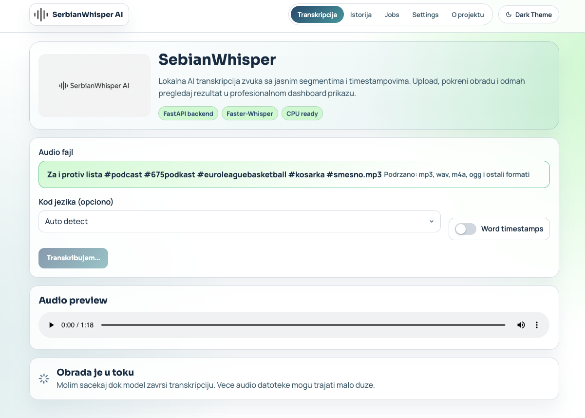
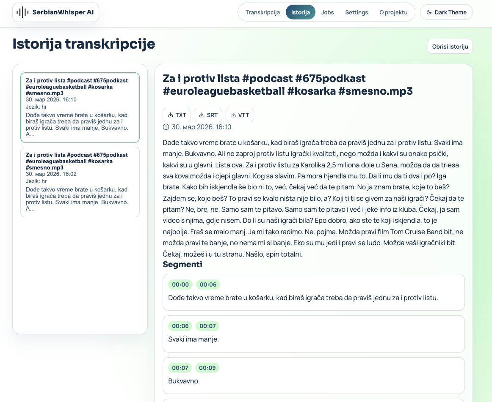

<p align="center">
  
</p>

<p align="center">
  
</p>

<h1 align="center">SerbianWhisper Clinical Assistant</h1>

<p align="center">
  Local-first demo platforma za medicinsku transkripciju i automatsko formiranje nacrta otpusne liste.
</p>

<p align="center">
  
  
  
  
  
  
</p>

## O projektu

SerbianWhisper Clinical Assistant je lokalna web aplikacija koja pokriva ceo tok rada:

- upload audio fajla ili direktno snimanje preko mikrofona,
- transkripciju sa `faster-whisper`,
- pregled segmenta sa timestamp markerima,
- AI korekciju transkripta,
- generisanje draft otpusne liste u `AI` ili `Rule-based` režimu.

Aplikacija je pripremljena kao demo za bolnički UI scenario i radi bez cloud servisa.

## Trenutni workflow

1. Frontend šalje audio na backend (`/transcribe` ili `/transcribe-microphone`) kao `multipart/form-data`.
2. Backend koristi globalni `WhisperModel` koji se učitava jednom pri startup-u.
3. Odgovor vraća: detektovani jezik, pouzdanost jezika, kompletan tekst i segmente.
4. Opcionalno se pokreće AI korekcija (`/transcript-corrections`) radi pravopisnih/logičkih ispravki.
5. U modulu za otpusnu listu korisnik bira engine:
   - `AI model` (`/discharge-draft-ai`)
   - `Rule-based` (`/discharge-draft`)
6. Draft se prikazuje kao jedan celovit dokument spreman za ručnu medicinsku validaciju.

## Ključne funkcije

- jedinstven startup loading Whisper modela (`small`, `cpu`, `int8`)
- izbor modela u UI (`small` ili `large-v3-turbo`)
- audio upload + direktno mikrofonsko snimanje
- waveform timeline sa markerima segmenata
- sticky transcript panel + auto-highlight aktivnog segmenta
- light/dark + theme presets (`Mint`, `Studio`, `Classic`)
- export transkripta (`TXT`, `SRT`, `VTT`)
- lokalna istorija transkripata i jobs pregled
- AI korekcija transkripta (sa fallback-om)
- AI ili rule-based generisanje draft otpusne liste

## Screenshots

### Transkripcija



### Istorija



## Arhitektura

```mermaid
flowchart LR
  A[React + Vite Frontend] -->|multipart/form-data| B[FastAPI Backend]
  B --> C[faster-whisper WhisperModel]
  C --> B
  B -->|JSON transcript| A
  A --> D[/transcript-corrections]
  A --> E{Discharge Engine}
  E -->|AI| F[/discharge-draft-ai]
  E -->|Rule| G[/discharge-draft]
  D --> A
  F --> A
  G --> A
```

## API endpointi

| Method | Route | Opis |
|---|---|---|
| `GET` | `/health` | Status servisa, model info, Ollama config |
| `POST` | `/transcribe` | Transkripcija uploadovanog audio fajla |
| `POST` | `/transcribe-microphone` | Transkripcija mikrofonskog snimka |
| `POST` | `/transcript-corrections` | AI korekcija transkripta |
| `POST` | `/discharge-draft` | Rule-based draft otpusne liste |
| `POST` | `/discharge-draft-ai` | AI draft otpusne liste (Ollama) |

## Primer request/response

### `POST /transcribe`

```bash
curl -X POST "http://localhost:8000/transcribe" \
  -F "file=@/absolute/path/to/audio.mp3" \
  -F "language=sr" \
  -F "word_timestamps=true" \
  -F "transcription_model=turbo"
```

```json
{
  "model_used": "turbo",
  "model_name": "large-v3-turbo",
  "detected_language": "sr",
  "language_probability": 0.98,
  "text": "Pacijent je primljen zbog...",
  "segments": [
    {
      "start": 0.0,
      "end": 4.9,
      "text": "Pacijent je primljen zbog...",
      "words": [
        {
          "start": 0.1,
          "end": 0.6,
          "word": "Pacijent",
          "probability": 0.93
        }
      ]
    }
  ]
}
```

Napomena: polje `words` se vraća samo kada je `word_timestamps=true`.
Dozvoljene vrednosti za `transcription_model` su `small` i `turbo`.

## Lokalno pokretanje

### Preduslovi

- macOS/Linux
- Python `3.11` ili `3.12` (preporučeno)
- Node.js `18+`
- npm `9+`
- `ffmpeg` (preporučeno za fallback audio konverziju)
- opcionalno: `ollama` za AI korekcije i AI draft

Važno: izbegni Python `3.14` za ovaj projekat zbog kompatibilnosti dela ML zavisnosti.

### 1) Backend

```bash
cd backend
python3.11 -m venv .venv
source .venv/bin/activate
pip install --upgrade pip
pip install -r requirements.txt
uvicorn main:app --reload --host 0.0.0.0 --port 8000
```

Backend je dostupan na: `http://localhost:8000`

Brzi health check:

```bash
curl http://localhost:8000/health
```

### 2) Frontend

```bash
cd frontend
npm install
npm run dev
```

Frontend je dostupan na: `http://localhost:5173`

### 3) Ollama (opciono, za AI režim)

```bash
brew install ollama
ollama serve
ollama pull qwen2.5:3b-instruct
```

Ako Ollama nije aktivan, koristi `Rule-based` režim za draft.

## Konfiguracija

### Backend env

| Varijabla | Default | Opis |
|---|---|---|
| `WHISPER_MODEL` | `small` | naziv faster-whisper modela |
| `WHISPER_TURBO_MODEL` | `large-v3-turbo` | naziv turbo modela |
| `WHISPER_DEFAULT_TRANSCRIPTION_MODEL` | `small` | podrazumevani model (`small` ili `turbo`) |
| `WHISPER_DEVICE` | `cpu` | uređaj za inferenciju |
| `WHISPER_COMPUTE_TYPE` | `int8` | compute tip |
| `OLLAMA_ENABLED` | `true` | uključivanje Ollama integracije |
| `OLLAMA_BASE_URL` | `http://localhost:11434` | Ollama API URL |
| `OLLAMA_MODEL` | `qwen2.5:3b-instruct` | lokalni LLM model |
| `OLLAMA_TIMEOUT_SECONDS` | `90` | timeout za Ollama pozive |

### Frontend env

| Varijabla | Default | Opis |
|---|---|---|
| `VITE_API_BASE_URL` | `http://localhost:8000` | baza backend API-ja |

## Testiranje

Za prezentaciju je dostupan izveštaj:

- [TEST_REPORT_PRESENTATION.md](./TEST_REPORT_PRESENTATION.md)
- [TEST_REPORT_AI_QWEN.md](./TEST_REPORT_AI_QWEN.md)
- [TEST_REPORT_METRICS_KPI.md](./TEST_REPORT_METRICS_KPI.md)
- [TEST_REPORT_TURBO_COMPARISON.md](./TEST_REPORT_TURBO_COMPARISON.md)

Automatski AI/Qwen test paket:

```bash
backend/.venv/bin/python -m pytest -q backend/tests/test_ai_qwen_pipeline.py
```

KPI metrika test paket (WER/CER/confidence):

```bash
backend/.venv/bin/python -m pytest -q backend/tests/test_transcription_metrics.py
backend/.venv/bin/python backend/tests/print_metrics_demo.py
```

## Troubleshooting

- `Failed to fetch` u frontend-u:
  - backend nije pokrenut na `http://localhost:8000`
  - pogrešan `API Base URL` u Settings
  - CORS blokada ako frontend nije na `localhost:5173`

- `ModuleNotFoundError` tokom backend starta:
  - aktiviraj venv i ponovi `pip install -r requirements.txt`

- AI endpointi ne rade:
  - pokreni `ollama serve`
  - proveri model sa `ollama list`
  - po potrebi prebaci na `Rule-based` režim

- Mikrofon ne radi:
  - dozvoli microphone access u browser-u
  - koristi HTTPS ili localhost okruženje

## Struktura repozitorijuma

```text
SerbianWhisper/
├── assets/
│   ├── mini-logo.png
│   ├── serbianwhisper-logo.jpg
│   └── screenshots/
│       ├── ss1.png
│       └── ss2.png
├── backend/
│   ├── main.py
│   ├── requirements.txt
│   └── README.md
├── frontend/
│   ├── public/
│   │   ├── mini-logo.png
│   │   ├── serbianwhisper-logo.jpg
│   │   └── metropolitan-20.png
│   ├── src/
│   │   ├── App.jsx
│   │   ├── App.css
│   │   └── main.jsx
│   ├── package.json
│   └── README.md
├── TEST_REPORT_PRESENTATION.md
└── README.md
```

## Akademski kontekst

Projekat je rađen u okviru teme primene veštačke inteligencije u kliničkoj dokumentaciji.

Tim:
- Dimitrije Milenković
- Nemanja Vidić
- Stevan Stojanović

Institucija:
- Univerzitet Metropolitan

## Odgovorno korišćenje

Ovaj sistem je demo alat. Svaki generisani medicinski sadržaj mora da prođe stručnu validaciju pre realne upotrebe.
