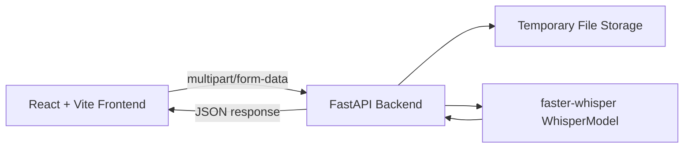

<p align="center">
  
</p>

<p align="center">
  
</p>

<h1 align="center">SerbianWhisper AI</h1>

<p align="center">
  Local-first audio transcription platform with a React frontend, FastAPI backend, and Faster-Whisper inference.
</p>

<p align="center">
  
  
  
  
  
  
</p>

## Product Overview

SerbianWhisper AI is a production-minded MVP for speech-to-text transcription.
It is designed for local development and testing, with clear separation between frontend and backend responsibilities.

Core workflow:
- Upload audio (or record from microphone) in the browser.
- Send audio using `multipart/form-data` to the backend.
- Transcribe with `faster-whisper` on the server.
- Return and render full transcript + timestamped segments.

## Key Capabilities

- Reusable Whisper model instance (loaded once at backend startup)
- Upload transcription and microphone transcription flows
- Waveform timeline with segment markers and click-to-seek
- Sticky transcript panel with active segment highlighting during playback
- Light/Dark mode plus theme presets (`Mint`, `Studio`, `Classic`)
- Word-level timestamps toggle
- Export transcription as `TXT`, `SRT`, and `VTT`
- Responsive UI with desktop and mobile navigation

## Screenshots

### Transcription View


### History View


## Architecture



## Technology Stack

| Layer | Technology |
|---|---|
| Frontend | React (JavaScript), Vite, Fetch API |
| Backend | FastAPI, Uvicorn, Python |
| Transcription | faster-whisper (`WhisperModel`) |
| Audio transport | `multipart/form-data` |
| Default inference mode | `model=small`, `device=cpu`, `compute_type=int8` |

## Repository Structure

```text
SerbianWhisper/
├── assets/
│   ├── mini-logo.png
│   ├── serbianwhisper-logo.jpg
│   └── screenshots/
│       ├── ss1.png
│       └── ss2.png
├── backend/
│   ├── main.py
│   ├── requirements.txt
│   └── README.md
├── frontend/
│   ├── public/
│   │   ├── mini-logo.png
│   │   └── serbianwhisper-logo.jpg
│   ├── src/
│   │   ├── App.jsx
│   │   ├── App.css
│   │   └── main.jsx
│   ├── package.json
│   └── README.md
└── README.md
```

## API Specification

### Health Check

- `GET /health`

### File Transcription

- `POST /transcribe`

Form fields:
- `file` (required)
- `language` (optional, e.g. `sr`, `en`)
- `word_timestamps` (optional, `true` or `false`)

### Microphone Transcription

- `POST /transcribe-microphone`

Uses the same form fields as `/transcribe`.

### Response Shape

```json
{
  "detected_language": "sr",
  "language_probability": 0.98,
  "text": "Full transcript text...",
  "segments": [
    {
      "start": 0.0,
      "end": 2.5,
      "text": "Segment text",
      "words": [
        {
          "start": 0.0,
          "end": 0.4,
          "word": "Zdravo",
          "probability": 0.92
        }
      ]
    }
  ]
}
```

`words` is included only when `word_timestamps=true`.

## Local Development Setup

### Prerequisites

- Python `3.11` or `3.12`
- Node.js `18+`
- npm `9+`

### 1) Backend

```bash
cd backend
python3 -m venv .venv
source .venv/bin/activate
pip install --upgrade pip
pip install -r requirements.txt
uvicorn main:app --reload --host 0.0.0.0 --port 8000
```

Backend URL: `http://localhost:8000`

### 2) Frontend

```bash
cd frontend
npm install
npm run dev
```

Frontend URL: `http://localhost:5173`

## Quick API Test

```bash
curl -X POST "http://localhost:8000/transcribe" \
  -F "file=@/absolute/path/to/audio.mp3" \
  -F "language=sr" \
  -F "word_timestamps=true"
```

## macOS Notes

- Start with CPU mode for local development:
  - `model=small`
  - `device=cpu`
  - `compute_type=int8`
- First transcription can be slower because model files are downloaded on first run.
- Microphone recording requires browser permission.

## Troubleshooting

- `Failed to fetch` in frontend:
  - Confirm backend is running on `http://localhost:8000`.
  - Check frontend `API Base URL` setting.
- Missing Python dependency error:
  - Activate virtual environment and reinstall with `pip install -r requirements.txt`.
- Python compatibility issues on newest interpreters:
  - Prefer Python `3.11` or `3.12` for best package compatibility in local setup.

## Author

Dimitrije Milenkovic
