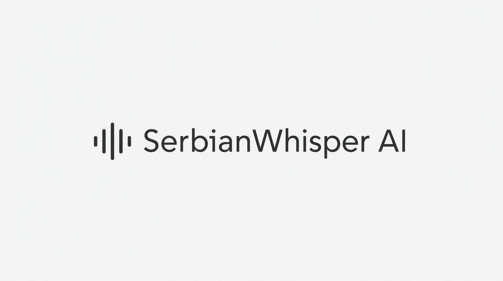
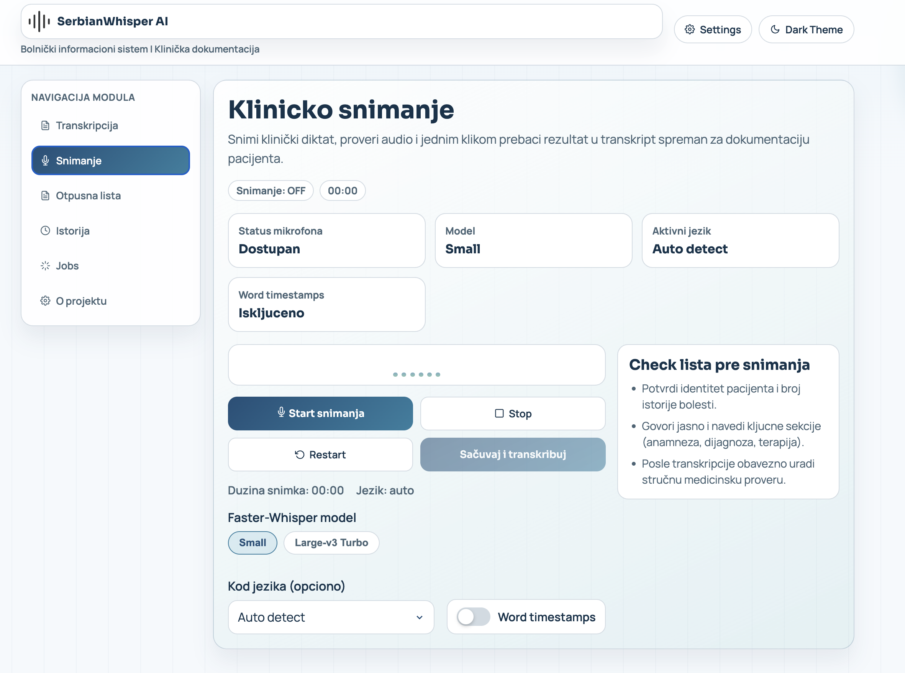
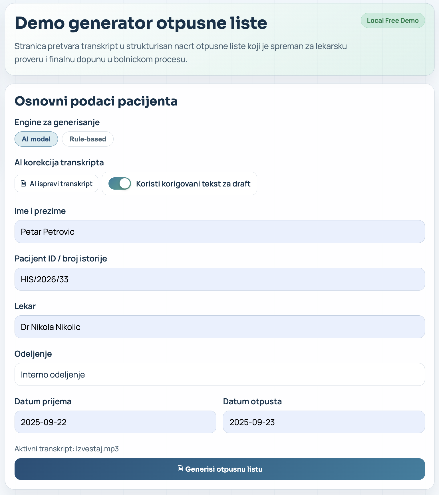
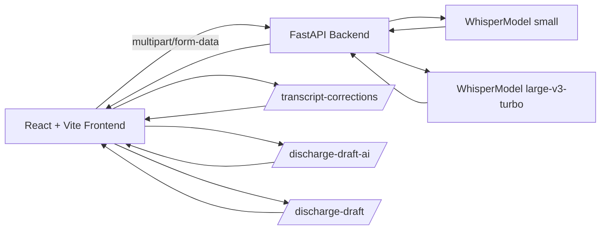

<p align="center">
  
</p>

<p align="center">
  
</p>

<h1 align="center">SerbianWhisper Clinical Assistant</h1>

<p align="center">
  Local-first medical transcription and discharge-draft generation platform built with React, FastAPI, and Faster-Whisper.
</p>

<p align="center">
  
  
  
  
  
  
</p>

## Overview

SerbianWhisper Clinical Assistant is a hospital-oriented demo application designed to accelerate clinical dictation workflows:

- Upload or record clinical audio.
- Transcribe with Faster-Whisper on the backend.
- Review full transcript, timeline segments, and word timestamps.
- Apply optional AI transcript correction.
- Generate a structured discharge draft using AI or rule-based mode.

The platform is local-first and suitable for controlled demo and academic environments.

## Core Capabilities

- FastAPI backend with reusable model instances loaded on startup
- React dashboard with medical-style UI and responsive navigation
- Audio upload and microphone recording workflows
- Model switch per transcription (`small` / `large-v3-turbo`)
- Waveform timeline with segment markers and click-to-seek navigation
- Sticky transcript panel with active segment highlighting during playback
- Export options: `TXT`, `SRT`, `VTT`
- AI transcript correction endpoint with robust fallback behavior
- Discharge draft generation in two modes:
  - AI mode (`/discharge-draft-ai`)
  - Rule-based mode (`/discharge-draft`)

## AI Stack

### 1) Speech Recognition (ASR)

- Engine: `faster-whisper`
- Runtime options:
  - `small` (faster, lighter)
  - `large-v3-turbo` (higher quality, heavier)
- Inference settings:
  - `vad_filter=True`
  - `beam_size=5`
  - default local runtime: `CPU + int8`

### 2) Clinical Text Correction

- Endpoint: `POST /transcript-corrections`
- Provider: local `Ollama` with `qwen2.5:3b-instruct`
- Output:
  - corrected transcript
  - correction list (`original`, `suggested`, `reason`, `confidence`)
  - quality notes
- Safety behavior: deterministic no-op fallback if AI is unavailable

### 3) Discharge Draft Generation

- AI mode endpoint: `POST /discharge-draft-ai`
- Rule mode endpoint: `POST /discharge-draft`
- Structured fields include:
  - patient metadata
  - diagnosis blocks
  - hospital course
  - procedures
  - discharge therapy
  - recommendations and red flags

## Screenshots

### Clinical Recording Workspace



### Discharge Draft Generation Workspace



## Architecture



## API Endpoints

| Method | Route | Purpose |
|---|---|---|
| `GET` | `/health` | Service and model status |
| `POST` | `/transcribe` | Audio file transcription |
| `POST` | `/transcribe-microphone` | Microphone recording transcription |
| `POST` | `/transcript-corrections` | AI transcript correction |
| `POST` | `/discharge-draft` | Rule-based discharge draft |
| `POST` | `/discharge-draft-ai` | AI discharge draft |

## Quick Start

### Prerequisites

- macOS or Linux
- Python `3.11` or `3.12`
- Node.js `18+`
- npm `9+`
- `ffmpeg` (recommended)

### 1) Start Backend

```bash
cd backend
python3.11 -m venv .venv
source .venv/bin/activate
pip install --upgrade pip
pip install -r requirements.txt
uvicorn main:app --reload --host 0.0.0.0 --port 8000
```

Backend URL: `http://localhost:8000`

### 2) Start Frontend

```bash
cd frontend
npm install
npm run dev
```

Frontend URL: `http://localhost:5173`

### 3) Start AI Runtime (Optional)

```bash
brew install ollama
ollama serve
ollama pull qwen2.5:3b-instruct
```

If Ollama is not running, the app can still operate with rule-based fallback paths.

## Example Transcription Request

```bash
curl -X POST "http://localhost:8000/transcribe" \
  -F "file=@/absolute/path/to/audio.mp3" \
  -F "language=sr" \
  -F "word_timestamps=true" \
  -F "transcription_model=turbo"
```

Allowed values for `transcription_model`:
- `small`
- `turbo`

## Configuration

### Backend Environment Variables

| Variable | Default | Description |
|---|---|---|
| `WHISPER_MODEL` | `small` | Base ASR model name |
| `WHISPER_TURBO_MODEL` | `large-v3-turbo` | Turbo ASR model name |
| `WHISPER_DEFAULT_TRANSCRIPTION_MODEL` | `small` | Default request model (`small`/`turbo`) |
| `WHISPER_DEVICE` | `cpu` | Inference device |
| `WHISPER_COMPUTE_TYPE` | `int8` | Inference compute type |
| `OLLAMA_ENABLED` | `true` | Enable/disable local AI integration |
| `OLLAMA_BASE_URL` | `http://localhost:11434` | Ollama API base URL |
| `OLLAMA_MODEL` | `qwen2.5:3b-instruct` | AI model used for correction/drafts |
| `OLLAMA_TIMEOUT_SECONDS` | `90` | Ollama request timeout |

### Frontend Environment Variables

| Variable | Default | Description |
|---|---|---|
| `VITE_API_BASE_URL` | `http://localhost:8000` | Backend API base URL |

## Testing

Available reports:

- [TEST_REPORT_PRESENTATION.md](./TEST_REPORT_PRESENTATION.md)
- [TEST_REPORT_AI_QWEN.md](./TEST_REPORT_AI_QWEN.md)
- [TEST_REPORT_METRICS_KPI.md](./TEST_REPORT_METRICS_KPI.md)
- [TEST_REPORT_TURBO_COMPARISON.md](./TEST_REPORT_TURBO_COMPARISON.md)

Run core backend tests:

```bash
backend/.venv/bin/python -m pytest -q backend/tests/test_ai_qwen_pipeline.py backend/tests/test_transcription_metrics.py
```

## Security and Responsibility Notice

This project is intended for demo and academic use. Any clinical text generated by the system must be reviewed and validated by qualified medical professionals before real-world use.

## Project Team

<p>
  
</p>

Developed by:

- Dimitrije Milenković
- Nemanja Vidić
- Stevan Stojanović

University Metropolitan Belgrade
